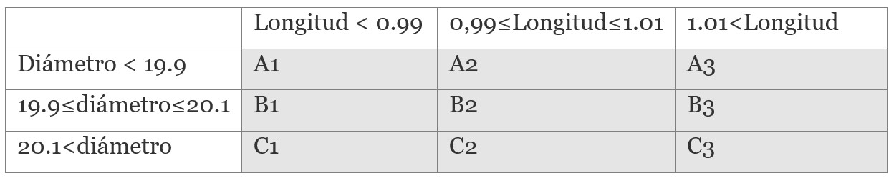

```{r setup, include=FALSE}
knitr::opts_chunk$set(echo = TRUE)
```

Este enunciado es común para las cuestiones 1-5. Una fábrica produce tubos en línea, de longitud aproximada 1 metro y diámetro exterior aproximado 20 mm. Se cuenta con la siguiente tabla en la que se representan unos sucesos estadísticos de acuerdo con los resultados de producción indicados:



Por ejemplo, cuando sale de la línea de producción un tubo de 1.01 metros de longitud y un diámetro exterior de 20.3mm, el tubo se clasifica como C~2~.

¿Cuál de los siguientes representa el espacio muestral?

El espacio muestral se representa de la siguiente forma:

$$
A_1 \cup A_2 \cup A_3 \cup B_1 \cup B_2 \cup B_3 \cup C_1 \cup C_2 \cup C_3
$$

¿Cuál es el suceso complementario de $A_1$?

Ninguna de las opciones mostradas.

Pregunta 3: ¿Cuál es el suceso $A_2 \cap A_3$?

El suceso $A_2 \cap A_3$ es aquel que incluye los elementos con un diámetro menor que $19.9$ y cuya longitudad está a la vez en el intervalo $0.99 \leq L < 1.01$

# Test 4

## Ejercicio 1: Funciones de Densidad

Para analizar y explicar los conceptos estadísticos involucrados en la identificación de una función de densidad de probabilidad, primero definamos lo que es una función de densidad y las condiciones que debe cumplir.

### Identificación de una función de densidad

Una función de densidad de probabilidad (FDP) es una función que describe la probabilidad relativa de una variable aleatoria continua de tomar un valor específico. 

La FDP cumple las siguientes características:

* **No negatividad:** $f(x) \geq 0$ para todo $x$. Esto significa que la función de densiad no puede tomar valores negativos, ya que no tendría sentido hablar de probabilidades negativas.
* **Normalización:** $\int_{-\infty}^{\infty} f(x) dx = 1$. Esto significa que la probabilidad total de que la variable aleatoria tome cualquier valor es igual a 1.

```{r}
# Cargando el paquete
library(ggplot2)

# Creando una secuencia de valores
x <- seq(-4, 4, length = 100)

# Calculando la densidad de la distribución normal para estos valores
y <- dnorm(x)

# Creando el gráfico
ggplot(data.frame(x, y), aes(x, y)) + 
  geom_line() + 
  ggtitle("Distribución Normal Estándar") +
  xlab("x") + 
  ylab("f(x)")
```

### Ejercicio 1

Ejercicio donde se determine el valor de un parámetro necesario para que una función dada sea una función de densidad de probabilidad en un intervalo específico.

Consideremos la siguiente función con un parámetro $a$:

$$
f(x) = a \cdot x^2, \quad 0 \leq x \leq 1
$$
Supongamos que queremos que $f(x)$ sea una FDP en el intervalo definido. ¿Cuál debe ser el valor de $a$?

Para que $f(x)$ sea una FDP, debe cumplir las siguientes condiciones:

* $f(x) \geq 0$ para todo $x$ en el intervalo. Esto significa que $a \cdot x^2 \geq 0$ para todo $x$ en el intervalo. Como $x^2 \geq 0$ para todo $x$, entonces $a \geq 0$.
* $\int_{-\infty}^{\infty} f(x) dx = 1$. Esto significa que $\int_{0}^{1} a \cdot x^2 dx = 1$. Resolviendo la integral, obtenemos $\dfrac{a}{3} = 1$, por lo que $a = 3$.

Verificamos con R:

```{r}
# Definición de la función con a = 3
f <- function(x) { 3 * x^2 }

# Calculando la integral de la función en el intervalo [0, 1]
integrate(f, 0, 1)
```

## Ejercicio 2: Relación entre FDP y FDA

La FDA se puede obtener integrando la FDP desde $-\infty$ hasta $x$. Por lo que nos proporciona la probabilidad de que la variable aleatoria sea menor o igual que $x$.

$$
F(x) = \int_{-\infty}^{x} f(t) dt
$$

### Ejercicio 2

Dada la siguiente función de densidad por intervalos:

$$
f(x) = \begin{cases}
x, & 0 \leq x < 1 \\
0.25, & 1 \leq x \leq 3 \\
0, & \text{en otro caso}
\end{cases}
$$

Calcula la FDA de la variable aleatoria $X$.

Dado que la FDP, $f(x)$, es una función por intervalos, debemos calcular la FDA por intervalos. Primero, calculemos la FDA para $x < 1$:

$$
F(x) = \int_{-\infty}^{x} f(t) dt = \int_{0}^{x} t dt = \dfrac{x^2}{2}
$$
Cuando $1 \leq x \leq 3$, la FDA es:

$$
F(x) = \int_{-\infty}^{x} f(t) dt = \int_{0}^{1} t dt + \int_{1}^{x} 0.25 dt = \dfrac{1}{2} + \dfrac{x-1}{4} = \frac{1}{4}(x + 1)
$$

Finalmente, cuando $x > 3$, la FDA es:

$$
F(x) = \int_{-\infty}^{x} f(t) dt = \int_{0}^{1} t dt + \int_{1}^{3} 0.25 dt + \int_{3}^{x} 0 dt = \dfrac{1}{2} + \dfrac{1}{4} + 0 = \dfrac{3}{4}
$$


# Test 5

## Pregunta 7

Se tira un dado cuatro veces, se define la variable $X$ como *el número de veces que se obtiene un resultado menor que 4*, ¿Cuál es la probabilidad de que ocurra $X=3$?

### Respuesta

Comencemos por entender el experimento y la variable aleatoria $X$.

El experimento consiste en tirar un dado cuatro veces. Cada vez que se tira el dado, se obtiene un número entre 1 y 6. Por lo tanto, la variable aleatoria $X$ puede tomar los valores 0, 1, 2, 3 y 4. El valor de $X$ es el número de veces que se obtiene un resultado menor que 4. Por lo tanto, $X = x$ podrá obtener los valores 1, 2 y 3.

El objetivo es calcular la probabilidad de que $X = 3$, lo que significa que en tres de las cuatro tiradas obtenemos un número menor que 4.

Para este problema, utilizaremos la distribución binomial. La distribución binomial es apropiada cuando se tienen las siguientes condiciones:

* Hay un número fijo de ensayos.
* Cada ensayo es independiente.
* Cada ensayo tiene dos resultados posibles: éxito o fracaso.
* La probabilidad de éxito es la misma para cada ensayo.

La probabilidad de éxito, es decir, la probabilidad de obtener un número menor que 4 en una sola tirada, es $P(\text{éxito}) = P(X<4) = \dfrac{3}{6} = 0.5$. Ya que hay tres resultados favorables (1, 2 y 3) y seis resultados posibles (1, 2, 3, 4, 5 y 6). La probabilidad de fracaso es $P(\text{fracaso}) = P(X \geq 4) = \dfrac{3}{6} = 0.5$.

La fórmula de la distribución binomial para calcular la probabilidad de obtener exactamente $k$ éxitos en $n$ ensayos es:

$$
P(X = k) = \binom{n}{k} p^k (1-p)^{n-k}
$$
Donde:

* $\bino{n}{k}$ es el coeficiente binomial, que representa el número de formas en que pueden elegirse $k$ éxitos en $n$ ensayos.
* $p$ es la probabilidad de éxito.
* $1-p$ es la probabilidad de fracaso.

Para nuestro ejercicio queremos calcualr $P(X = 3)$, por lo que $k = 3$, $n = 4$, $p = 0.5$ y $1-p = 0.5$. Sustituyendo en la fórmula, obtenemos:

$$
P(X = 3) = \binom{4}{3} 0.5^3 0.5^{4-3} = 4 \cdot 0.5^4 = 0.25
$$
Por tanto la probabilidad de que $X = 3$ es $0.25$.

Para visualizar esto, podemos crear una gráfica de la distribución binomial de $X$. Generaré una gráfica donde se muestre la probabilidad de obtener $k$ éxitos (es decir, $k$ resultados menores que 4) para $k$ entre 0 y 4.

```{r}
# Cargar la biblioteca para gráficos
library(ggplot2)

# Parámetros de la distribución binomial
n <- 4  # número de ensayos
p <- 1/2  # probabilidad de éxito

# Crear un vector con los posibles números de éxitos
k <- 0:n

# Calcular las probabilidades binomiales
probabilidades <- dbinom(k, size = n, prob = p)

# Crear un data frame para el gráfico
data <- data.frame('Éxitos' = k, 'Probabilidad' = probabilidades)

# Crear el gráfico de barras
ggplot(data, aes(x = Éxitos, y = Probabilidad)) +
  geom_bar(stat = "identity", fill = "skyblue") +
  xlab("Número de éxitos (X)") +
  ylab("Probabilidad") +
  ggtitle("Distribución Binomial de X (número de veces con resultado < 4)") +
  theme_minimal()

```

La gráfica muestra la distribución binomial de la variable $X$ para nuestro experimento. Cada barra representa la probabilidad de obtener un cierto número de éxitos en las cuatro tiradas del dado.

Como se puede observar, la probabilidad de obtener exactamente 3 éxitos es 0.25, como se calculó anteriormente.


