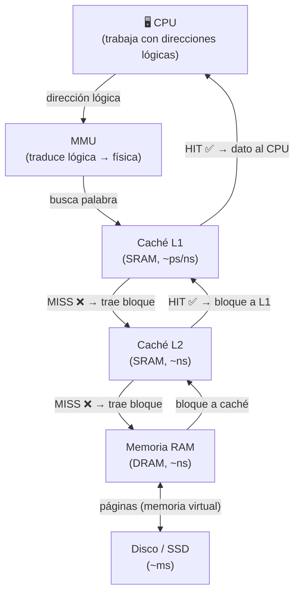

### Evaluación de Prestaciones y Jerarquía de Memoria

---

## 📢 ANUNCIOS Y AVISOS DEL PROFESOR

- **Taller este viernes, día 20**, a las **17:00h (hora de Madrid)**, duración de 90 minutos. Se graba. Se trabajarán ejercicios de caché y Ley de Amdahl.
- Las **presentaciones de todos los temas** serán subidas al área de documentación (el profesor lo hará al día siguiente de la clase para actualizarlas).
- La presentación del **Tema 3 ya está disponible** en el área de documentación.
- En el **examen se proporcionará un formulario** con las fórmulas — no es necesario memorizarlas.

---

## ⚠️ NOTAS IMPORTANTES (Posible material de examen)

> ⚠️ **Los ejercicios de evaluación de prestaciones (Ley de Amdahl / Speedup) son material frecuente de examen.** El profesor lo enfatiza explícitamente varias veces.

> ⚠️ **Los problemas de memoria caché también son muy frecuentes en el examen.** El profesor confirma que "muy probablemente sí" entrarán.

> ⚠️ **Definición de Speedup:** La aceleración es siempre tiempo anterior entre tiempo nuevo. Si el resultado es menor que 1, se ha puesto la fórmula al revés.

> ⚠️ **Principio clave de la Ley de Amdahl:** No tiene sentido optimizar lo que se usa poco. La mejora global está limitada por la fracción del tiempo que _no_ se puede mejorar.

> ⚠️ **Definiciones formales de Hit y Miss** (memoria caché): términos técnicos que deben manejarse con precisión.

---

## 🎯 ACTIVIDADES Y EJERCICIOS

- **Taller práctico (Actividad grupal)**
    - **Descripción:** Sesión de ejercicios en directo de 90 minutos.
    - **Contenido:** Ejercicios de Ley de Amdahl, Speedup y memoria caché.
    - **Objetivo:** Consolidar la evaluación de prestaciones con problemas numéricos.
    - **Deadline / Fecha:** Viernes 20, 17:00h hora de Madrid.

---

## 📚 CONTENIDO DE LA CLASE

---

### 1. Programas de Prueba (Benchmarks)

**Explicación accesible:** Un _benchmark_ es una herramienta estandarizada para comparar el rendimiento de diferentes procesadores o sistemas. Como elegir un portátil hoy es muy complejo (hay decenas de modelos con arquitecturas distintas), se usan benchmarks para tener una referencia objetiva. Páginas como Passmark ofrecen índices agregados de rendimiento.

**Tipos de benchmarks (de más a menos realistas):**

|Tipo|Descripción|Realismo|Ejemplo|
|---|---|---|---|
|Aplicaciones reales|El programa completo tal cual|Máximo|Photoshop, GCC|
|Aplicaciones con script|Igual, pero sin interacción humana y sin E/S|Alto|Simulación de usuario|
|**Kernels**|Fragmentos extraídos de programas reales|**Medio-alto**|**LINPACK, LAPACK**|
|Toys / Sintéticos simples|Algoritmos conocidos pero no extraídos de programas reales|Medio|QuickSort, Criba de Eratóstenes|
|Sintéticos puros|Secuencias de instrucciones sin algoritmo real detrás|Mínimo|Dhrystone, Whetstone|

**Detalle importante — por qué los Kernels son los más usados en la práctica:** Las aplicaciones reales tienen demasiadas variables externas (sistema operativo multitarea, interacción del usuario, accesos a disco, versión del compilador y sus optimizaciones). Los kernels eliminan esas variables al ser fragmentos aislados de código real, representativos de la carga que se va a ejecutar.

**Dhrystone y Whetstone:** miden operaciones de punto fijo y punto flotante respectivamente, pero de forma completamente sintética — ejecutan un millón de divisiones seguidas sin que eso represente ningún algoritmo real.

**Conexión con otros temas:** La elección del benchmark depende del tipo de carga que ejecutará el sistema (HPC, IA, ofimática), lo que conecta directamente con el concepto de _fracción de tiempo de uso_ que veremos en la Ley de Amdahl.

---

### 2. Speedup (Aceleración)

**Explicación accesible:** El speedup mide cuánto hemos mejorado el rendimiento global de un sistema tras introducir una mejora. Si antes tardábamos 10 segundos y ahora tardamos 4, hemos mejorado 2,5 veces.

**Formalización:**

$$S = \frac{T_{anterior}}{T_{nuevo}}$$

Donde $T_{anterior} > T_{nuevo}$ siempre (estamos reduciendo el tiempo). Si $S < 1$, la fórmula está invertida.

**En velocidades** (equivalente, pero trabajaremos siempre con tiempos de CPU):

$$S = \frac{V_{nueva}}{V_{original}}$$

**Ejemplo práctico:** Si $V_{original} = 2$ y $V_{nueva} = 5$, entonces $S = 5/2 = 2{,}5$. Eso significa que la nueva velocidad es el 250% de la original, o lo que es lo mismo, hemos mejorado un 150%.

---

### 3. Ley de Amdahl

**Explicación accesible:** Cuando mejoramos solo _una parte_ del sistema (por ejemplo, la unidad de multiplicación), la mejora global está limitada por cuánto tiempo usamos realmente esa parte. Si paso el 80% del tiempo haciendo otras cosas, por mucho que mejore la multiplicación, nunca podré mejorar el sistema más de 5 veces (en el ejemplo del 20% restante). Es como mejorar el motor de un coche que el 80% del tiempo está parado en un atasco: la mejora real es mínima.

**Formalización (versión recomendada por el profesor):**

$$S = \frac{1}{(1 - F) + \frac{F}{s}}$$

Donde:

- $S$ = Speedup total (mejora global)
- $F$ = fracción del tiempo en que **sí** se usa la mejora _(F mayúscula)_
- $s$ = mejora parcial aplicada a esa fracción _(s minúscula)_
- $(1-F)$ = fracción del tiempo en que **no** se usa la mejora _(f minúscula en notación alternativa)_

**Versión alternativa equivalente** (puede aparecer en ejercicios con otra notación):

$$T_{final} = T_{no_afectado} + \frac{T_{afectado}}{s}$$

**Ejemplo práctico resuelto en clase:**

Un programa tarda 100 segundos. El 80% del tiempo realiza multiplicaciones. ¿Cuánto hay que mejorar la multiplicación para que el programa sea 5 veces más rápido?

- $T_{inicial} = 100$ s, $T_{final\ deseado} = 20$ s
- $T_{no_afectado} = 20$ s, $T_{afectado} = 80$ s

$$20 = 20 + \frac{80}{s} \implies \frac{80}{s} = 0 \implies s = \infty$$

**Conclusión didáctica:** Es _imposible_ conseguir una mejora global de 5× solo mejorando la multiplicación si el tiempo no afectado ya ocupa los 20 segundos deseados. La Ley de Amdahl establece que hay un **techo infranqueable** en la mejora global.

**Extensión a varias mejoras simultáneas no solapadas:**

$$S = \frac{1}{(1 - \sum F_i) + \sum \frac{F_i}{s_i}}$$

Esta forma es simétrica y más elegante para múltiples mejoras que no se solapan en el tiempo.

**Conexión con otros conceptos:** El profesor menciona la analogía con la **Ley de Pareto (80/20)**: el 20% de las tareas consume el 80% del tiempo → conviene optimizar ese 20%. La Ley de Moore, en cambio, es una _observación empírica_, no una ley analítica como Amdahl.

---

### 4. Coste de un Computador

**Explicación accesible:** El precio final de un procesador tiene varias capas de coste.

- **Costes directos:** imputables a cada unidad fabricada (materiales, energía...).
- **Costes indirectos:** compartidos entre diferentes líneas de producción (personal de administración, seguridad, mantenimiento). Son costes fijos difíciles de asignar por unidad.
- **Beneficio empresarial:** remuneración del capital invertido en la línea de producción.
- **Costes de distribución:** llevar el producto desde la fábrica (Taiwán, Singapur) hasta el punto de venta.

🔍 _[El profesor menciona este bloque brevemente sin desarrollarlo en profundidad — verificar con los apuntes del Tema 2 completo]_

---

### 5. Jerarquía de Memoria

**Explicación accesible:** Los ordenadores organizan la memoria en niveles, como los espacios de tu casa: lo que más usas está en la mesa (registros, caché), lo que usas poco está en el trastero (disco duro). A mayor cercanía al procesador: más velocidad, más coste, menos capacidad.

**Pirámide de la jerarquía (de más cercano a más lejano):**

```
        [Registros CPU]         ← ns/ps, bytes, carísimo
           [Caché L1]
           [Caché L2]
           [Caché L3]           ← ns, MB, caro
        [Memoria RAM]           ← ns, GB, moderado
       [Disco duro / SSD]       ← ms, TB, barato
            [Red]               ← segundos, baratísimo/bit
```

**Tecnología:** La caché usa **RAM estática (SRAM)** — más transistores, más rápida, más cara. La RAM principal usa **RAM dinámica (DRAM)** — condensadores que hay que refrescar continuamente, más barata, más lenta.

**Principios de localidad** _(conceptos fundamentales)_:

- **Localidad temporal:** Si accedo a un dato ahora, es probable que lo vuelva a usar pronto (ej. índice de un bucle, variable acumuladora).
- **Localidad espacial:** Si accedo a una posición de memoria, es probable que acceda a las posiciones contiguas (ej. recorrer un array).

---

### 6. Memoria Caché — Funcionamiento

**Explicación accesible:** La caché es una memoria pequeña, rápida y cara que actúa como "mesa de trabajo" del procesador. Cuando el procesador necesita un dato, primero busca en caché. Si está → acceso rápido. Si no está → hay que ir a memoria principal, que es mucho más lenta.

**Unidad de transferencia:**

- Entre **procesador ↔ caché**: se transfiere una **palabra** (32 o 64 bits).
- Entre **caché ↔ memoria principal**: se transfiere un **bloque** (conjunto de K palabras contiguas). Esto aprovecha la localidad espacial.

**Estructura de una línea de caché:**

- **Datos:** K palabras (el bloque)
- **Etiqueta (tag):** indica qué dirección de memoria principal representa
- **Dirty bit:** indica si el dato ha sido modificado en caché pero aún no se ha escrito en memoria principal

**Hit y Miss:**

|Término|Significado|
|---|---|
|**Hit (acierto)**|El dato solicitado SÍ está en caché → acceso rápido|
|**Miss (fallo)**|El dato solicitado NO está en caché → hay que ir a memoria principal y traer el bloque|

**Políticas de escritura** _(mencionadas brevemente)_:

- **Write-through:** al escribir en caché, se actualiza también memoria principal inmediatamente.
- **Write-back (copy-back):** se escribe solo en caché (dirty bit = 1); se actualiza memoria principal cuando la línea va a ser reemplazada.

**Métricas de rendimiento:**

$$h = \frac{\text{número de hits}}{\text{total de referencias}} \quad \text{(tasa de aciertos)}$$

$$\text{Tasa de fallos} = 1 - h$$

$$T_{medio} = h \cdot T_{caché} + (1-h) \cdot T_{principal}$$

$$\lambda = \frac{T_{principal}}{T_{medio}} \quad \text{(índice de mejora)}$$

La relación $\tau = T_{caché} / T_{principal}$ suele estar entre 0,1 y 0,5 (la caché es entre 2 y 10 veces más rápida).

**Transparencia para el procesador:** El procesador trabaja siempre con **direcciones lógicas**. La **MMU (Memory Management Unit)** traduce a direcciones físicas. La caché es invisible para el programa — solo nota que algunos accesos son más rápidos que otros.

---

## 🗺️ DIAGRAMA — Jerarquía de Memoria y flujo de acceso



---

## 📝 RESUMEN EJECUTIVO

1. **Los benchmarks permiten comparar sistemas**, pero su validez depende de cuán representativa sea la carga respecto al uso real. Los **kernels** son el estándar práctico por eliminar variables externas (SO, compilador, usuario, E/S).
    
2. **El Speedup** mide la mejora global de rendimiento: $S = T_{anterior} / T_{nuevo}$. Si da menor que 1, la fórmula está invertida.
    
3. **La Ley de Amdahl** establece que la mejora global de un sistema está **acotada por la fracción de tiempo que NO se mejora**. Conviene mejorar aquello que se usa más tiempo.
    
4. **El techo de Amdahl es infranqueable:** si el tiempo no afectado ya iguala el tiempo objetivo, la mejora parcial necesaria es infinita. Esto limita el diseño de procesadores.
    
5. **La jerarquía de memoria** equilibra velocidad, coste y capacidad en múltiples niveles: registros → caché → RAM → disco → red, con latencias que van de picosegundos a segundos.
    
6. **La caché explota los principios de localidad** (temporal y espacial) para anticipar qué datos necesitará el procesador y tenerlos disponibles con mínima latencia.
    
7. **Hit/Miss y tiempo medio de acceso** son las métricas clave de la caché. El tiempo medio pondera ambos tiempos con sus tasas respectivas: $T_m = h \cdot T_c + (1-h) \cdot T_p$.
    
8. **El Taller del viernes (día 20, 17:00h)** cubrirá ejercicios numéricos de Ley de Amdahl y caché — material altamente probable en el examen.