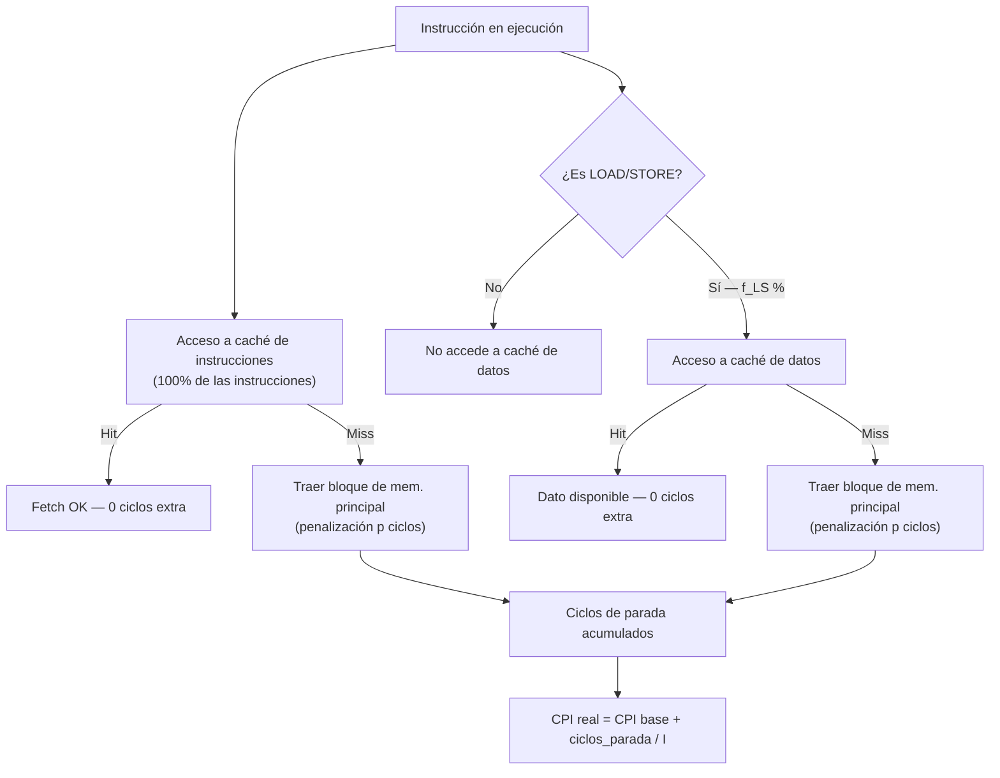

---

## 📢 ANUNCIOS Y AVISOS DEL PROFESOR

- Los materiales de los talleres **no se subirán por adelantado** (a diferencia de las presentaciones de teoría), para forzar la resolución autónoma de los ejercicios.
- Los talleres se han reorganizado: antes eran 9 talleres de 1 hora, ahora son **4 talleres de 1 hora y media**. Esta sesión corresponde al **Taller 3**.
- La semana siguiente habrá clase de teoría el martes para terminar el **tema de jerarquía de memoria**: memoria caché, memoria virtual y, si da tiempo, entrada/salida.
- **Recordatorio:** Entregar las actividades antes del fin de semana.

---

## ⚠️ NOTAS IMPORTANTES (Posible material de examen)

> ⚠️ **Los ejercicios de caché entran en el examen.** El profesor lo afirma explícitamente: _"Este tipo de ejercicios sí que hay en el examen."_

> ⚠️ **Criterio de calificación en el examen:** Se valora más el **razonamiento y los pasos intermedios** que el resultado numérico final. Un error aritmético descuenta poco; un razonamiento incorrecto, mucho.

> ⚠️ **Cuidado con los porcentajes vs. ratios:** No se puede decir que A es un 150% más rápido que B si el ratio es 1,5. Lo correcto es decir que A es **1,5 veces más rápido** o un **50% más rápido** (ratio − 1 = incremento). "El rendimiento de A es un 150% del de B" sí es correcto.

> ⚠️ **Criterio de preferencia entre arquitecturas:** El criterio de **tiempo de ejecución tiene prioridad** sobre MIPS. Una máquina puede ejecutar más instrucciones por segundo y aun así ser más lenta si sus instrucciones aportan menos.

> ⚠️ **La tasa de fallos de caché no es una métrica del procesador:** Depende del programa que se ejecute. Programas con muchos saltos (e.g., OOP con herencia y polimorfismo) tienen mayor miss rate en instrucciones; programas con bucles pequeños, menor.

> ⚠️ **Todas las instrucciones acceden a la caché de instrucciones (100%).** Solo las instrucciones de carga/almacenamiento acceden a la caché de datos. Esto es fundamental para plantear los cálculos de ciclos de parada.

> ⚠️ **Ley de Amdahl:** Mejorar una parte del sistema no mejora el sistema entero en la misma proporción. Se recomienda usar la forma: $S = \dfrac{1}{(1 - F) + \dfrac{F}{m}}$

---

## 🎯 ACTIVIDADES Y EJERCICIOS

**Ejercicio 1 — Comparación de rendimiento simple**

- **Descripción:** Computador A ejecuta un programa en 10 s, B en 15 s. ¿Cuánto más rápido es A respecto a B?
- **Objetivo:** Practicar el cálculo de ratio de rendimiento e interpretar correctamente el resultado como ratio y como porcentaje.
- **Deadline:** No aplica (ejercicio de clase).

**Ejercicio 2 — Caché con penalización uniforme**

- **Descripción:** Miss rate instrucciones 3%, datos 7%; CPI base = 2; penalización = 100 ciclos; frecuencia load/store = 41%. Calcular cuánto más rápido es la caché perfecta.
- **Objetivo:** Calcular ciclos de parada por acceso a memoria de instrucciones y datos por separado, y combinarlos para obtener el CPI real.
- **Deadline:** No aplica (ejercicio de clase).

**Ejercicio 3 — MIPS y comparación de máquinas**

- **Descripción:** Máquina A = 35 s, Máquina B = 21 s, 522 millones de instrucciones. Calcular ratio de velocidad y MIPS de cada máquina.
- **Objetivo:** Practicar el cálculo de MIPS y reflexionar sobre cuándo dos métricas coinciden o se contradicen.
- **Deadline:** No aplica (ejercicio de clase).

**Ejercicio 4 — Caché con penalización asimétrica**

- **Descripción:** Miss rate instrucciones 2%, datos 12%; frecuencia load/store 31%; CPI implícito = 100 ciclos / 25 instrucciones = 4; penalización instrucciones 120 ciclos, datos 110 ciclos.
- **Objetivo:** Variante del ejercicio 2 con penalizaciones distintas para instrucciones y datos.
- **Deadline:** No aplica (ejercicio de clase).

**Ejercicio 5 — Ley de Amdahl (punto flotante)**

- **Descripción:** Mejora de ×10 en instrucciones de punto flotante que representan el 40% del tiempo. Calcular la aceleración global.
- **Objetivo:** Aplicar la Ley de Amdahl para cuantificar la mejora global de una optimización parcial.
- **Deadline:** No aplica (ejercicio de clase).

---

## 📚 CONTENIDO DE LA CLASE

### Comparación de rendimiento: ratio y porcentaje

**Explicación accesible:** Cuando se comparan dos sistemas, el ratio de velocidad se obtiene dividiendo el tiempo del más lento entre el del más rápido. Si A tarda 10 s y B tarda 15 s, A es más rápido. El ratio es 15/10 = 1,5, lo que significa que A es **1,5 veces más rápido**. El incremento porcentual es (1,5 − 1) × 100 = **50% más rápido**.

**Formalización:**

$$\text{Ratio} = \frac{T_B}{T_A} = \frac{R_A}{R_B}$$

El incremento porcentual de velocidad de A respecto a B es $(\text{Ratio} - 1) \times 100%$.

**Ejemplo práctico:** $T_A = 10\text{ s},\ T_B = 15\text{ s} \Rightarrow \text{Ratio} = 1{,}5 \Rightarrow$ A es un 50% más rápido que B.

**Conexión:** Base para todos los ejercicios de rendimiento y para la Ley de Amdahl.

---

### Ciclos de parada por acceso a memoria (miss penalty)

**Explicación accesible:** Cuando una instrucción necesita un dato o una instrucción que no está en caché (miss), el procesador se detiene ("para") mientras trae el bloque desde memoria principal. Esas paradas se miden en ciclos y se suman al CPI base.

Hay dos fuentes de paradas:

- **Caché de instrucciones:** Todas las instrucciones del programa deben buscarse aquí. Miss rate × penalización × número de instrucciones.
- **Caché de datos:** Solo las instrucciones de carga/almacenamiento acceden a la memoria de datos. Su contribución es: frecuencia load/store × miss rate × penalización.

**Formalización:**

$$\text{Ciclos parada instrucciones} = I \times m_i \times p$$

$$\text{Ciclos parada datos} = I \times f_{LS} \times m_d \times p$$

$$\text{CPI real} = \text{CPI base} + \frac{\text{Ciclos parada instrucciones} + \text{Ciclos parada datos}}{I}$$

donde $I$ = número de instrucciones, $m_i$ = miss rate instrucciones, $m_d$ = miss rate datos, $f_{LS}$ = fracción de instrucciones load/store, $p$ = penalización por fallo.

**Ejemplo práctico (Ejercicio 2):**

|Parámetro|Valor|
|---|---|
|CPI base|2|
|Miss rate instrucciones|3%|
|Miss rate datos|7%|
|Frecuencia load/store|41%|
|Penalización|100 ciclos|

$$\text{Parada instrucciones} = I \times 0{,}03 \times 100 = 3I$$

$$\text{Parada datos} = I \times 0{,}41 \times 0{,}07 \times 100 = 2{,}87I$$

$$\text{CPI real} = 2 + 3 + 2{,}87 = 7{,}87 \text{ ciclos/instrucción}$$

$$\text{Mejora} = \frac{7{,}87}{2} = 3{,}93\times \text{ (un 293% mejor con caché perfecta)}$$

**Conexión:** El CPI real alimenta la ecuación fundamental de rendimiento: $T_{CPU} = I \times \text{CPI} \times t_{ciclo}$.

---

### Por qué todas las instrucciones acceden a la caché de instrucciones

**Explicación accesible:** El procesador no "sabe" de antemano qué instrucciones va a ejecutar; las va leyendo secuencialmente desde la memoria de instrucciones gracias al **Program Counter (PC)**. Por tanto, el 100% de las instrucciones generan un acceso a la caché de instrucciones. Solo el subconjunto de instrucciones load/store accede además a la caché de datos. Esto explica que la primera instrucción de un programa pueda generar **dos fallos simultáneos**: uno de instrucciones (la caché está vacía) y otro de datos (si es una instrucción de carga/almacenamiento).

**Conexión:** Justifica por qué en la fórmula de paradas de instrucciones se usa $I$ completa, mientras que en datos se usa $f_{LS} \times I$.

---

### Arquitectura registro-registro (RISC) y accesos a memoria de datos

**Explicación accesible:** En una arquitectura RISC (registro-registro), ninguna operación aritmética puede operar directamente sobre datos en memoria RAM. Para sumar dos valores, primero hay que cargarlos en registros con instrucciones `LOAD`, luego operar con `ADD`, y finalmente guardar el resultado con `STORE`. Esto hace que las instrucciones load/store sean las únicas que generan accesos a la caché de datos.

**Ejemplo práctico:**

```asm
LOAD  R2, 0x1000   ; Carga dato de memoria → accede a caché de datos
LOAD  R3, 0x1004   ; Carga dato de memoria → accede a caché de datos
ADD   R2, R2, R3   ; Opera en registros → NO accede a caché de datos
STORE R2, 0x1008   ; Almacena en memoria → accede a caché de datos
```

**Conexión:** Explica por qué el enunciado da la frecuencia de instrucciones load/store como dato necesario para calcular los fallos de caché de datos.

---

### Principio de localidad espacial y tamaño de bloque

**Explicación accesible:** Cuando se produce un fallo de caché, no se trae solo el dato pedido, sino un **bloque entero** (ej. 4 palabras consecutivas). El motivo es el principio de localidad espacial: es muy probable que las instrucciones o datos cercanos en memoria también sean necesarios pronto. Así, el primer acceso a una zona genera un fallo (y cuesta 100 ciclos), pero los siguientes accesos a esa misma zona ya encuentran el bloque en caché y cuestan solo el CPI base.

**Conexión:** Explica por qué la tasa de fallos no es del 100% aunque la primera instrucción siempre falle.

---

### Políticas de escritura: Write-through vs. Write-back (Copy-back)

**Explicación accesible:** Cuando se escribe un dato modificado en caché, hay dos estrategias:

- **Write-through:** Se escribe simultáneamente en caché **y** en memoria principal. Más consistente, pero más lento.
- **Write-back (Copy-back):** Solo se escribe en caché y se activa el **dirty bit** (bit de "sucio"). La actualización en memoria principal se aplaza hasta que esa línea de caché deba ser reemplazada. Más eficiente, ya que evita escrituras innecesarias en memoria principal si el dato no fue modificado.

**Conexión:** Tema que se desarrollará en más detalle en clases de teoría.

---

### MIPS (Millones de Instrucciones Por Segundo)

**Explicación accesible:** Los MIPS miden la velocidad de ejecución de una máquina. Se calculan dividiendo el número de instrucciones entre el tiempo de ejecución, expresado en millones.

**Formalización:**

$$\text{MIPS} = \frac{I}{T \times 10^6}$$

**Advertencia:** Los MIPS no son un criterio de rendimiento definitivo. Una máquina puede tener más MIPS y aun así tardar más en ejecutar el mismo programa si sus instrucciones hacen menos trabajo individualmente. **El tiempo de ejecución siempre tiene prioridad.**

---

### Ley de Amdahl

**Explicación accesible:** Si se mejora una parte del sistema (ej. instrucciones de punto flotante), la aceleración global está limitada por la fracción del tiempo que esa parte representa. Mejorar diez veces algo que solo ocupa el 40% del tiempo da una aceleración total muy inferior a 10.

**Formalización:**

$$S = \frac{1}{(1 - F) + \dfrac{F}{m}}$$

donde $F$ = fracción del tiempo que usa la parte mejorada, $m$ = factor de mejora de esa parte.

**Ejemplo práctico (Ejercicio 5):** $F = 0{,}4$, $m = 10$:

$$S = \frac{1}{(1 - 0{,}4) + \dfrac{0{,}4}{10}} = \frac{1}{0{,}6 + 0{,}04} = \frac{1}{0{,}64} \approx 1{,}56$$

La mejora global es solo ×1,56 (56% más rápido), no ×10.

**Conexión:** Concepto fundamental de diseño de arquitecturas: siempre hay que identificar el cuello de botella real del sistema antes de optimizar.

---

## 🗺️ DIAGRAMA



---

## 📝 RESUMEN EJECUTIVO

1. **El CPI real = CPI base + ciclos de parada por caché.** Los fallos de caché penalizan enormemente el rendimiento (100 ciclos extra por fallo frente a 2-4 ciclos base).
2. **Dos fuentes de fallos independientes:** instrucciones (afectan al 100% de las instrucciones) y datos (afectan solo al porcentaje de instrucciones load/store).
3. **Fórmula de paradas de datos:** $I \times f_{LS} \times m_d \times p$. No confundir con instrucciones, donde la fracción es 1 (todas acceden).
4. **Para comparar con caché perfecta:** dividir CPI real entre CPI base. El número de instrucciones $I$ y el tiempo de ciclo se cancelan cuando el programa y la arquitectura son los mismos.
5. **MIPS no es criterio definitivo:** el tiempo de ejecución siempre manda. Dos MIPS altos pueden coexistir con peor rendimiento si las instrucciones son menos potentes.
6. **Ley de Amdahl:** mejorar parcialmente el sistema da mejoras globales limitadas. La fracción no mejorada es el techo. Se recomienda la forma $S = 1 / [(1-F) + F/m]$.
7. **En el examen:** razonamiento > resultado numérico. Incluir unidades, justificar el uso de $I$ como variable, y verificar que los resultados sean mayores que 1 y positivos.